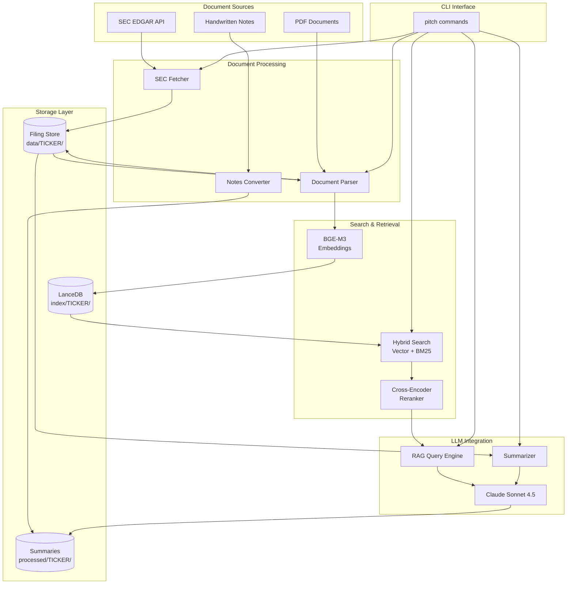
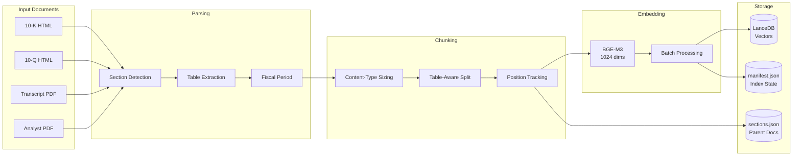
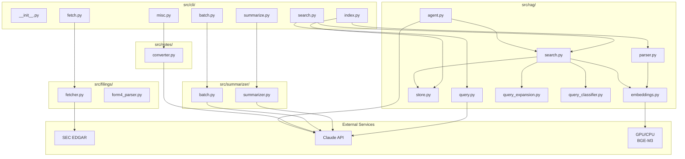

# RAG Pipeline Architecture

## Overview

The RAG (Retrieval-Augmented Generation) pipeline provides intelligent document retrieval and question-answering capabilities for financial document analysis. It combines hybrid search (vector similarity + BM25 full-text search) with Claude LLM integration to answer complex queries about SEC filings, earnings transcripts, and analyst reports.

## System Diagrams

### High-Level System Overview



### Indexing Pipeline



### Query Pipeline



```mermaid
flowchart LR
    subgraph Input["User Query"]
        Q[Query String]
    end

    subgraph Classify["Query Analysis"]
        C1[Query Classifier]
        C2[Weight Selection]
    end

    subgraph Expand["Query Expansion"]
        E1[Acronym Expansion]
        E2[Synonym Addition]
    end

    subgraph Search["Hybrid Search"]
        S1[Vector Search]
        S2[FTS Search]
        S3[Score Fusion]
    end

    subgraph Rerank["Reranking"]
        R1[Cross-Encoder]
        R2[Top-K Selection]
    end

    subgraph Context["Context Building"]
        X1[Parent Section Fetch]
        X2[Adjacent Chunks]
        X3[Deduplication]
    end

    subgraph LLM["LLM"]
        L1[Claude Sonnet]
        L2[Source Citations]
    end

    Q --> C1 --> C2
    C2 --> E1 --> E2
    E2 --> S1 & S2
    S1 & S2 --> S3
    S3 --> R1 --> R2
    R2 --> X1 --> X2 --> X3
    X3 --> L1 --> L2
```

### Module Dependency Graph



## Components

### Parser (`src/rag/parser.py`)

Extracts text from SEC filings with section detection and table-aware chunking.

- Supports 10-K, 10-Q, 8-K, DEF 14A filing types
- HTML-based section detection with fallback to text-based regex
- Converts tables to markdown format
- Chunks sections into content-type-specific sizes with configurable overlap
- Extracts fiscal metadata from iXBRL tags
- Table detection, classification, and table-aware chunking

### Embeddings (`src/rag/embeddings.py`)

Generates and manages embeddings using BGE-M3.

- 1024-dimension embeddings with 8192 token context window
- GPU-accelerated with CUDA/MPS support
- Cross-encoder reranking with BGE Reranker v2 M3
- Automatic memory management and batch size tuning

### Vector Store (`src/rag/store.py`)

LanceDB-based storage with per-company isolation.

- Hybrid search (vector similarity + BM25 full-text search)
- Metadata filtering on ticker, filing_type, filing_date, section
- Incremental indexing with hash-based change detection
- FTS (full-text search) index for keyword matching
- Parent-child section storage for context expansion

### Search (`src/rag/search.py`)

High-level search interface.

- Three search modes: vector, FTS, hybrid
- Optional cross-encoder reranking
- Context window generation for LLM queries
- Query expansion with financial domain knowledge
- Parent-child context retrieval

### Query (`src/rag/query.py`)

Claude-powered RAG query engine.

- Integrates search with Claude Sonnet 4.5
- Configurable context window (default 4000 tokens)
- Source citation tracking
- Parent-child section retrieval enabled by default

## Design Decisions

### 1. Parent-Child Document Hierarchy

**Description**: Two-level chunking strategy with parent documents (sections) and child chunks.

**Design**:

```python
@dataclass
class ParentDocument:
    """A logical document unit (e.g., a section)"""
    doc_id: str  # e.g., "10K_2024_Item1A_Risk_Factors"
    text: str  # Full section text
    metadata: dict
    child_chunks: list[str]  # IDs of child chunks

@dataclass
class ChildChunk:
    """A searchable chunk within a parent"""
    chunk_id: str
    parent_id: str
    text: str
    position: int  # Position within parent (0-indexed)
    metadata: dict
```

**Retrieval strategy**:

1. Search at child chunk level for precision
1. When chunk is retrieved, fetch parent document
1. Return parent document as context (fuller picture)
1. Optionally include surrounding chunks

### 2. Chunk Position Tracking and Context Expansion

**Description**: Track chunk positions and enable fetching surrounding chunks for expanded context.

**Design**:

```python
@dataclass
class Chunk:
    chunk_id: str  # Unique ID: "{source}_{section}_{chunk_index}"
    prev_chunk_id: str | None
    next_chunk_id: str | None
    position_in_section: int
    total_chunks_in_section: int
    is_section_start: bool
    is_section_end: bool
```

**Methods**:

```python
# In search.py
def get_chunk_with_context(
    self,
    chunk_id: str,
    before: int = 1,  # Chunks before
    after: int = 1,   # Chunks after
) -> list[SearchResult]:
    """Fetch chunk with surrounding context"""

def expand_results_with_context(
    self,
    results: list[SearchResult],
    context_window: int = 1,
) -> list[SearchResult]:
    """Expand each result with adjacent chunks"""
```

### 3. Specialized Table Handling

**Description**: Treat tables as first-class objects with special chunking and retrieval strategies.

**Design**:

```python
@dataclass
class TableChunk:
    """Special chunk type for tables"""
    table_id: str
    caption: str
    headers: list[str]
    rows: list[list[str]]
    context: str  # Surrounding text explaining the table
    table_type: str  # "financial", "comparison", "summary"
    metadata: dict
```

**Chunking strategy**:

- Keep tables under 2000 tokens intact
- For large tables, split by row groups but repeat headers
- Store table structure separately (enable table-specific queries)
- Add descriptive caption/context as embedding target

**Search enhancements**:

- Filter for tables only: `content_type="table"`
- Table-specific prompts: "Find tables with {metric}"
- Embed caption separately from table content

### 4. Query Expansion with Financial Domain Knowledge

**Description**: Expand queries with synonyms, acronyms, and related terms before search.

**Design**:

```python
class QueryExpander:
    """Expand queries with domain knowledge"""

    # Financial synonyms
    SYNONYMS = {
        "revenue": ["sales", "top line", "income", "turnover"],
        "profit": ["earnings", "net income", "bottom line"],
        "debt": ["liabilities", "borrowings", "obligations"],
        # ... extensive dictionary
    }

    # Financial acronyms
    ACRONYMS = {
        "NIM": "Net Interest Margin",
        "NRR": "Net Revenue Retention",
        "ARR": "Annual Recurring Revenue",
        "ROE": "Return on Equity",
        # ... extensive dictionary
    }

    def expand(self, query: str) -> list[str]:
        """Generate query variations"""
        # 1. Expand acronyms
        # 2. Add synonyms
        # 3. Add related terms
        # Return list of query variations
```

**Search strategy**:

- Generate 3-5 query variations
- Search with each variation
- Merge and deduplicate results
- Rerank combined results

### 5. Semantic Chunking Based on Document Structure

**Description**: Create chunks at semantic boundaries rather than arbitrary token counts.

**Design**:

```python
class SemanticChunker:
    """Chunk based on semantic completeness"""

    def chunk_section(self, section: Section) -> list[Chunk]:
        """
        Create chunks at semantic boundaries:
        1. Identify paragraph boundaries
        2. Detect complete thoughts using NLP
        3. Keep tables intact
        4. Identify lists and keep together
        5. Detect subsections
        6. Create variable-size chunks (500-2000 tokens)
        """
```

**Strategies**:

- Use sentence embeddings to detect topic shifts
- Keep complete risk factors together (even if > 1000 tokens)
- Keep executive summary paragraphs intact
- Split only when semantic similarity drops below threshold

### 6. Content-Type-Specific Chunk Sizes

**Description**: Use different chunk sizes for different content types.

**Design**:

```python
CHUNK_SIZE_BY_CONTENT = {
    "executive_summary": 2000,  # Preserve narrative
    "risk_factors": 1500,        # One risk per chunk
    "mda": 1500,                 # Preserve analysis
    "financial_statements": 500, # Smaller, table-focused
    "business_description": 1200,
    "default": 1000,
}

class AdaptiveChunker:
    """Adjust chunk size by content type"""

    def chunk_section(self, section: Section) -> list[Chunk]:
        content_type = self.detect_content_type(section)
        chunk_size = CHUNK_SIZE_BY_CONTENT.get(content_type, 1000)
        # Use content-specific chunk size
```

### 7. Dynamic Hybrid Search Weighting by Query Type

**Description**: Classify queries and adjust vector/FTS weights accordingly.

**Design**:

```python
class QueryClassifier:
    """Classify queries to optimize search strategy"""

    QUERY_TYPES = {
        "exact_metric": {"vector": 0.3, "fts": 0.7},      # "Q2 revenue"
        "conceptual": {"vector": 0.8, "fts": 0.2},        # "What are risks?"
        "entity": {"vector": 0.2, "fts": 0.8},            # "{COMPANY}"
        "trend": {"vector": 0.6, "fts": 0.4},             # "revenue growth"
        "comparison": {"vector": 0.7, "fts": 0.3},        # "compare 2023 vs 2024"
    }

    def classify(self, query: str) -> dict[str, float]:
        """Classify query and return optimal weights"""
        # Use patterns, keywords, or lightweight classifier
```

### 8. Feedback Loop and Continuous Improvement

**Description**: Log search results and collect implicit feedback for improvement.

**Design**:

```python
@dataclass
class SearchFeedback:
    query: str
    results: list[SearchResult]
    selected_results: list[int]  # Which results user clicked/used
    timestamp: datetime

# Log to JSONL for analysis
# Analyze patterns:
# - Which queries perform poorly (no clicks)?
# - Which search modes work best per query type?
# - What terms need synonym expansion?
```

**Usage**:

- Analyze logs to tune hybrid search weights
- Identify missing synonyms/acronyms
- Find common queries that fail (add to test suite)
- Collect training data for reranker fine-tuning

### 9. Multi-Hop Retrieval for Complex Questions

**Description**: Decompose complex questions and perform iterative retrieval.

**Design**:

```python
class MultiHopRAG:
    """Multi-step retrieval for complex questions"""

    def query_multihop(self, question: str) -> RAGResponse:
        # 1. Decompose question into sub-questions (use Claude)
        # 2. Answer each sub-question with retrieval
        # 3. Synthesize final answer from sub-answers
        # 4. Track reasoning chain
```

**Example**:

```
User: "How has {COMPANY}'s strategy evolved from 2023 to 2024?"

Step 1: "What was {COMPANY}'s strategy in 2023?"
  -> Retrieve from 2023 10-K, MD&A section

Step 2: "What is {COMPANY}'s strategy in 2024?"
  -> Retrieve from 2024 10-K, MD&A section

Step 3: Compare and synthesize evolution
```

### 10. Enhanced Metadata for Chunks

**Description**: Enrich chunks with semantic metadata during indexing.

**Design**:

```python
@dataclass
class EnrichedChunk(Chunk):
    content_type: str  # "text", "table", "list", "definition"
    entities: list[str]  # Named entities (companies, people, dates)
    metrics: list[str]  # Mentioned metrics ("revenue", "EBITDA")
    sentiment: str  # "positive", "negative", "neutral"
    time_period: str  # Extracted dates/periods mentioned

    # Structural metadata
    is_introduction: bool
    is_summary: bool
    has_numbers: bool
    has_comparisons: bool
```

**Enrichment pipeline**:

- Run NER (named entity recognition) on chunks
- Extract financial metrics with regex/patterns
- Detect temporal references
- Classify content type

**Usage**:

- Filter searches: "Find chunks mentioning EBITDA"
- Boost results: Prefer chunks with numbers for metric queries
- Better prompts: Tell Claude what type of content it's seeing

## Data Flow

### Indexing Pipeline

```
Source Documents (SEC filings, transcripts, analyst reports)
    |
    v
Parser: Extract sections, detect tables
    |
    v
Chunker: Split into chunks (content-type-specific sizes)
    |
    v
Embeddings: Generate BGE-M3 embeddings (1024 dimensions)
    |
    v
Vector Store: Store in LanceDB with metadata
    |
    v
Section Store: Store parent sections in sections.json
```

### Query Pipeline

```
User Query
    |
    v
Query Classifier: Determine query type, optimal weights
    |
    v
Query Expander: Generate query variations (synonyms, acronyms)
    |
    v
Hybrid Search: Vector + FTS with dynamic weights
    |
    v
Reranker (optional): Cross-encoder reranking
    |
    v
Context Expansion: Fetch parent sections or adjacent chunks
    |
    v
RAG Query Engine: Build context, send to Claude
    |
    v
Response with source citations
```

### Search Modes

| Mode   | Description                          | Best For                       |
| ------ | ------------------------------------ | ------------------------------ |
| Vector | Pure semantic similarity search      | Conceptual questions           |
| FTS    | Pure full-text search (BM25)         | Exact metric lookups, entities |
| Hybrid | Weighted combination of vector + FTS | General queries (default)      |

### Context Retrieval Options

| Option  | Description                      | Use Case                        |
| ------- | -------------------------------- | ------------------------------- |
| None    | Return chunk text only           | Quick lookups                   |
| Section | Return full parent section       | Deep analysis, context needed   |
| Window  | Return chunk + N adjacent chunks | Large sections, focused context |

## Implementation Details

This section documents the key implementation details for completed RAG improvements.

### Phase 1: Context Expansion (COMPLETE)

**Chunk Position Tracking** (`src/rag/parser.py`)

The `Chunk` dataclass includes position tracking fields:

```python
@dataclass
class Chunk:
    text: str
    metadata: dict = field(default_factory=dict)
    chunk_id: str = ""  # Unique ID: "{source}_{section}_{position}"
    prev_chunk_id: str | None = None
    next_chunk_id: str | None = None
    position_in_section: int = 0
    total_chunks_in_section: int = 0
    is_section_start: bool = False
    is_section_end: bool = False
```

**Parent-Child Section Retrieval** (`src/rag/store.py`, `src/rag/search.py`)

- `Section` dataclass with `section_id` and `approx_tokens` property
- Chunks have `section_id` field linking to parent section
- `sections.json` stores full section content (indexed during `pitch index`)
- `VectorStore.store_section()` and `get_section_for_chunk()` methods
- `SearchConfig.max_section_tokens` (default 8000) controls section vs. window mode

**Context Expansion Methods** (`src/rag/search.py`)

```python
# Fetch chunk with surrounding context
def get_chunk_with_context(chunk_id: str, before: int = 1, after: int = 1) -> list[SearchResult]

# Expand results with adjacent chunks
def expand_results_with_context(results: list[SearchResult], context_window: int = 1) -> list[SearchResult]

# Get full parent section (falls back to window for large sections)
def get_parent_context(result: SearchResult) -> str | None

# Batch section retrieval with deduplication
def expand_results_with_parent(results: list[SearchResult]) -> list[SearchResult]
```

**CLI Integration**

- `pitch ask`: Parent-child retrieval enabled by default in `_build_context()`
- `pitch search --context [none|section|window]`: Control context expansion
- `pitch search --max-chars N`: Control output length

### Phase 2: Table Intelligence (COMPLETE)

**Table Dataclass** (`src/rag/parser.py`)

```python
@dataclass
class Table:
    table_id: str
    html: str        # Raw HTML for future rendering
    markdown: str    # Markdown for search/embedding
    caption: str
    table_type: str  # financial_statement, compensation, governance, comparison, schedule, metrics, other
    approx_tokens: int
```

**Table Classification** (`src/rag/parser.py`)

- `classify_table()` with pattern matching on caption + content
- `TABLE_TYPE_PATTERNS` dict with regex patterns for each type
- Types: `financial_statement`, `compensation`, `governance`, `comparison`, `schedule`, `metrics`, `other`

**Table-Aware Chunking** (`src/rag/parser.py`)

- Tables under 2000 tokens kept intact as single chunks
- Larger tables split by rows with headers repeated
- `_split_large_table()` and `_is_table_paragraph()` helpers
- `_split_into_paragraphs()` preserves table newline structure

**Search Filters** (`src/rag/store.py`, `src/rag/search.py`)

- `content_type`, `table_type`, `is_table_continuation` added to chunk metadata
- `FILTERABLE_COLUMNS` updated in `store.py`
- `Searcher.search()` accepts `content_type` and `table_type` parameters

**Test Corpus**

50 diverse tables in `tests/fixtures/table_corpus.json`:

- Filing types: 12 10-K, 12 10-Q, 8 8-K, 18 DEF 14A
- Table types: comparison (19), other (22), compensation (4), governance (4), metrics (1)
- Sizes: small 2-5 rows (19), medium 6-20 rows (18), large 21+ rows (13)

### Phase 3: Query Enhancement (COMPLETE)

**Query Expansion** (`src/rag/query_expansion.py`)

```python
class QueryExpander:
    # 120+ acronym expansions (ARR, NRR, NIM, EBITDA, SBC, etc.)
    ACRONYMS: dict[str, str]

    # 50+ synonym clusters (revenue/sales/top line, profit/earnings/net income, etc.)
    SYNONYMS: dict[str, list[str]]

    def expand(self, query: str) -> ExpandedQuery:
        """Generate query variations with expanded terms"""
```

- Integrated into `Searcher.search()` with `expand_query=True` parameter (default)
- Multi-query search with automatic result deduplication

**Query Classification** (`src/rag/query_classifier.py`)

```python
class QueryType(Enum):
    EXACT_METRIC = "exact_metric"   # "Q2 2024 revenue" -> vector: 0.3, fts: 0.7
    CONCEPTUAL = "conceptual"        # "What are the main risks?" -> vector: 0.8, fts: 0.2
    ENTITY = "entity"                # "{COMPANY} AG" -> vector: 0.2, fts: 0.8
    TREND = "trend"                  # "revenue growth over time" -> vector: 0.6, fts: 0.4
    COMPARISON = "comparison"        # "compare 2023 vs 2024" -> vector: 0.7, fts: 0.3
    GENERAL = "general"              # default -> vector: 0.7, fts: 0.3
```

- Pattern-based classification using regex
- Dynamic hybrid search weights per query type
- Integrated into `search.py` with `auto_weight` config option (default: True)

**Feedback Logging** (`src/rag/feedback.py`)

```python
@dataclass
class SearchFeedback:
    timestamp: str
    ticker: str
    query: str
    query_type: str
    search_mode: str
    vector_weight: float
    num_results: int
    result_scores: list[float]
    result_sections: list[str]
    expand_query_used: bool
    rerank_used: bool
```

- JSONL-based logging to `index/{ticker}/search_feedback.jsonl`
- `analyze_feedback()` function for pattern analysis
- Integrated into `search.py` with `log_feedback` config option (default: True)

### Quick Wins (COMPLETE)

1. **Content-type-specific chunk sizes** (`src/rag/parser.py`)

   - `CHUNK_SIZE_BY_SECTION` config: Item 1 (1200), Item 1A/7 (1500), Item 8 (800), default (1000)
   - `_get_chunk_size_for_section()` method routes to correct size

1. **Chunk position tracking** (see Phase 1 above)

1. **Query classification for hybrid weights** (see Phase 3 above)

1. **Feedback logging** (see Phase 3 above)
